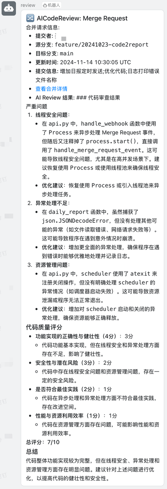

## 项目简介

本项目是一个基于大模型的自动化代码审查工具，帮助开发团队在代码合并或提交时，快速进行智能化的 Code Review，提升代码质量和开发效率。

- 大模型支持DeepSeek、ZhipuAI、OpenAI和Ollama。
- 消息推送支持钉钉、企业微信和飞书;

## 功能

- **代码审查:**
  使用大模型对代码进行分析和审查，并给出分数和建议。

- **自动发送审查结果:**
  自动推送审核结果到钉钉群，以及更新GitLab Merge Request 或 Commit 的 Note。

- **生成员工日报:**
  根据成员的Commit记录，自动生成工作日报。

**效果图:**





## 原理

当用户在 GitLab 上提交代码（包括 Merge Request 或 Push 操作）时，GitLab 会触发 webhook 事件，并
调用本系统的接口；本系统调用第三方大模型对提交的代码进行审查，并将审查结果记录在对应的 Merge Request 或 Commit 的 note
中。

## 部署

### 方案一：Docker 部署

**1. 创建.env文件**

复制本项目 .env.dist 文件内容到本地 .env 文件，并根据实际情况修改, 部分内容如下：

```bash
#服务端口
API_SERVER_PORT=5001
UI_SERVER_PORT=5002

#大模型供应商配置,支持 zhipuai , openai , deepseek or ollama
LLM_PROVIDER=deepseek

#DeepSeek
DEEPSEEK_API_KEY={YOUR_DEEPSEEK_API_KEY}

#支持review的文件类型(未配置的文件类型不会被审查)
SUPPORTED_EXTENSIONS=.java,.py,.php,.yml
#提交给大模型的最长字符数,超出的部分会截断,防止大模型处理内容过长或Token消耗过多
REVIEW_MAX_LENGTH=20000

#钉钉消息推送: 0不发送钉钉消息,1发送钉钉消息
DINGTALK_ENABLED=0
DINGTALK_WEBHOOK_URL={YOUR_WDINGTALK_WEBHOOK_URL}

#Gitlab配置
GITLAB_ACCESS_TOKEN={YOUR_GITLAB_ACCESS_TOKEN}
```

**2. 启动docker容器**

```bash
docker run -d --name codereview-gitlab \
  -p 5001:5001 \
  -p 5002:5002 \
  -v $(pwd)/.env:/app/.env \
  registry.cn-hangzhou.aliyuncs.com/stanley-public/ai-codereview-gitlab:1.0.8
```

### 方案二：本地Python环境部署

**1. 获取源码**


```bash
git clone https://github.com/sunmh207/AI-Codereview-Gitlab.git
cd AI-Codereview-Gitlab
```

**2. 安装依赖**

使用 Python 环境（建议使用虚拟环境 venv）安装项目依赖(Python 版本：3.10+):

```bash
pip install -r requirements.txt
```

**3. 配置环境变量**

同 Docker 部署方案中的 【创建.env文件】

**4. 启动服务**

```bash
python api.py
```

### 配置 GitLab Webhook

#### **a) 创建Access Token**

方法一：在 GitLab 个人设置中，创建一个 Personal Access Token。

方法二：在 GitLab 项目设置中，创建Project Access Token

#### **b) 配置 Webhook**

在 GitLab 项目设置中，配置 Webhook：

- URL：http://your-server-ip:5001/review/webhook
- Trigger Events：勾选 Push Events 和 Merge Request Events (不要勾选其它Event)
- Secret Token：上面配置的 Access Token(可选)

备注：系统会优先使用.env中的GITLAB_ACCESS_TOKEN，如果找到，则使用Webhook 传递的Secret Token

### 配置钉钉推送

- 在钉钉群中添加一个自定义机器人，获取 Webhook URL。
- 更新 .env 中的配置：
  ```
  #钉钉配置
  DINGTALK_ENABLED=1  #0不发送钉钉消息，1发送钉钉消息
  DINGTALK_WEBHOOK_URL=https://oapi.dingtalk.com/robot/send?access_token=xxx #替换为你的Webhook URL
  ```
- 如果使用企业机器人，需要配置DINGTALK_SECRET，具体可参考：https://open.dingtalk.com/document/orgapp/obtain-orgapp-token

### 配置企业微信推送

- 在企业微信群中添加一个自定义机器人，获取 Webhook URL。

- 更新 .env 中的配置：
  ```
  #企业微信配置
  WECOM_ENABLED=1  #0不发送企业微信消息，1发送企业微信消息
  WECOM_WEBHOOK_URL=https://qyapi.weixin.qq.com/cgi-bin/webhook/send?key=xxx  #替换为你的Webhook URL
  ```

### 配置飞书推送

- 在飞书群中添加一个自定义机器人，获取 Webhook URL。
- 更新 .env 中的配置：
  ```
  #飞书配置
  FEISHU_ENABLED=1
  FEISHU_WEBHOOK_URL=https://open.feishu.cn/open-apis/bot/v2/hook/xxx #替换为你的Webhook URL
  ```

## 交流

如果您有任何问题或建议，欢迎提交 Issue 或 PR，我会尽快处理。此外，您也可以添加微信与我交流：


